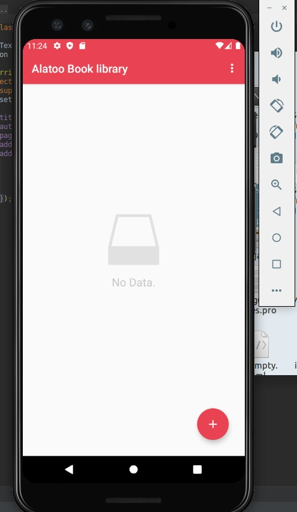
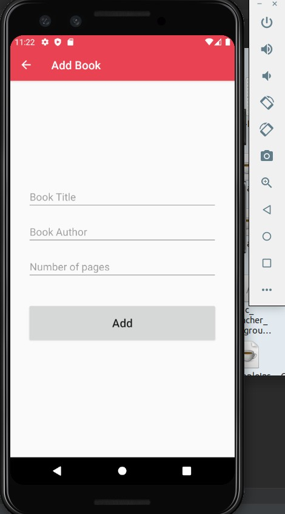
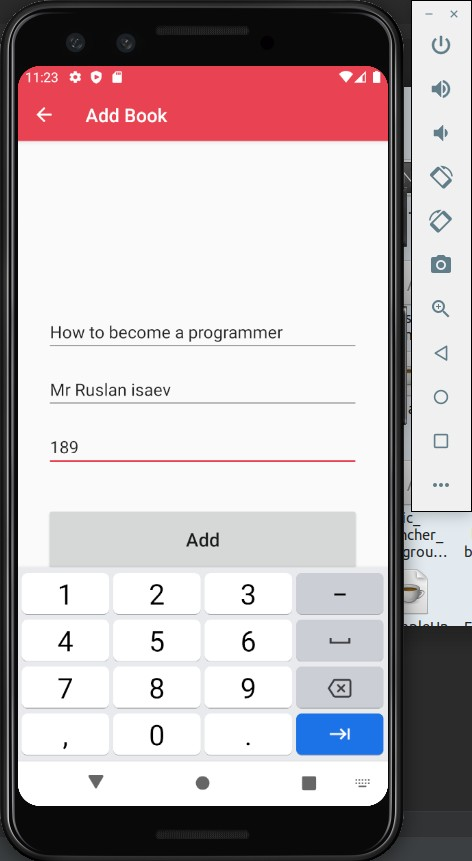
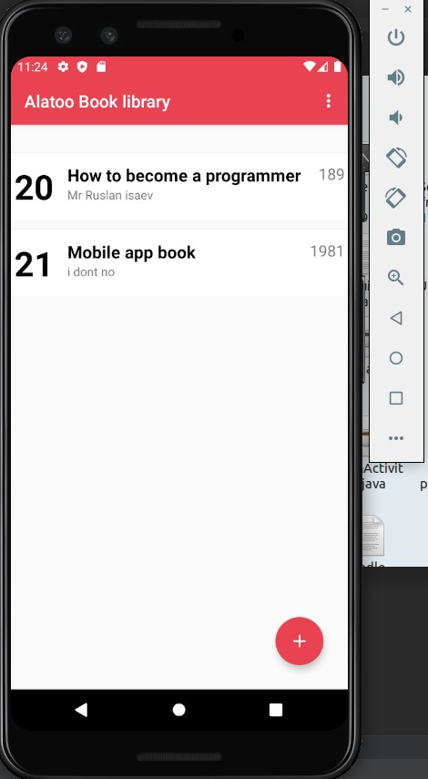
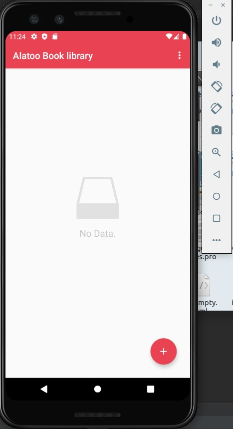
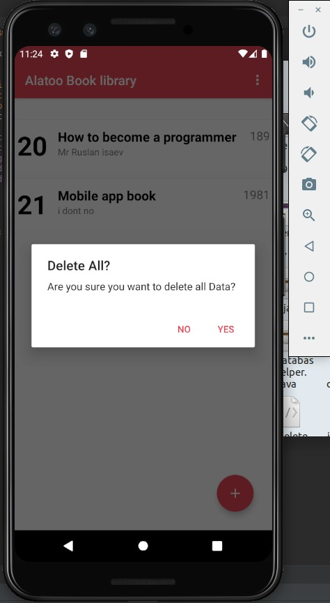

### MAD-final-project is about?
This project is about library storage for books, The app stores Book's name,author and number of pages that the book consist.
it uses Sqlite to store the data that the user inters.

# Figma design
### https://www.figma.com/file/Bv3YWsOQg946qc8Fy19Yrk/Project?node-id=0%3A1

# Screenshots

